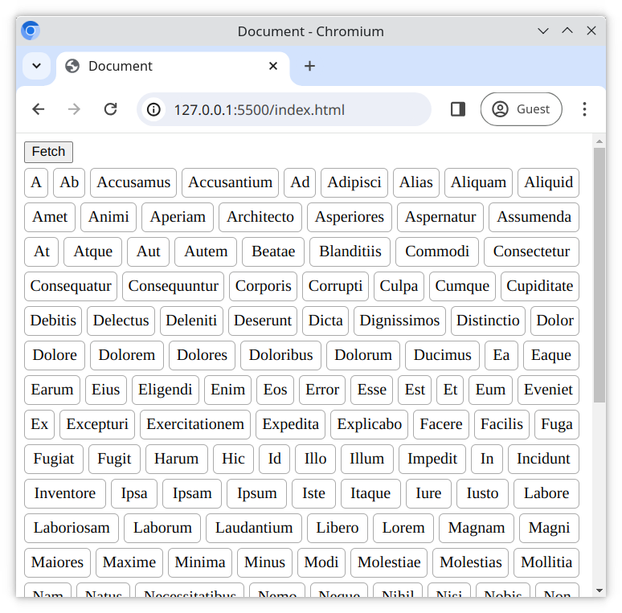

# Fetch and sort data

Here we will practice **Promises** through the **Fetch API**.

## Tasks

Your task is to load the list of words found in [data.txt](./data.txt), sort it and display it on the page.

### Task 1

Working in [main.js](./main.js);

1. Create a function called `processData`
2. When the `<button>` is clicked, it should run `processData`

### Task 2

The `processData` function should;

1. **Fetch** the contents of the file [data.txt](./data.txt)
2. **Convert** the fetched text data into an array, with each line of the text as a separate array item
3. **Sort** the array alphabetically
4. **Display** the sorted array as a `<ul>` list on the web page, with each array item as an `<li>` element

## Expected Result

