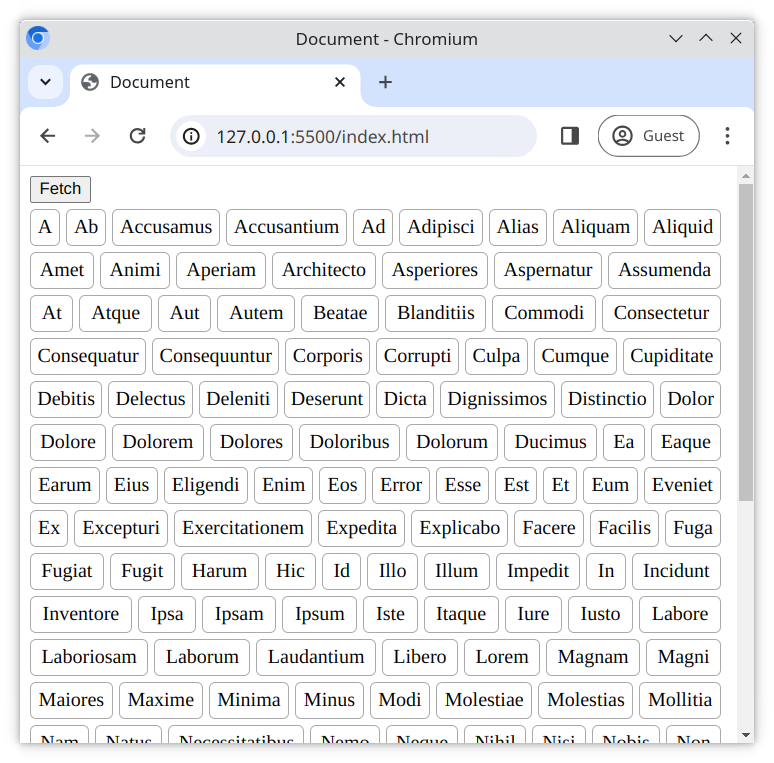

# Daten abrufen und sortieren

Hier werden wir **Promises** mit Hilfe der **Fetch API** üben.

## Aufgaben

Deine Aufgabe besteht darin, die Liste der Wörter in [data.txt](./data.txt) zu laden, zu sortieren und auf der Seite anzuzeigen.

### Aufgabe 1

Arbeite in [main.js](./main.js);

1. Erstelle eine Funktion namens `processData`.
2. Wenn der `<button>` geklickt wird, sollte `processData` ausgeführt werden.

### Aufgabe 2

Die Funktion `processData` sollte;

1. Den Inhalt der Datei [data.txt](./data.txt) **abfragen**.
2. Die abgerufenen Textdaten in ein Array umwandeln, wobei jede Zeile des Textes ein separates Arrayelement ist.
3. Das Array alphabetisch **sortieren**.
4. Das sortierte Array als `<ul>` Liste auf der Webseite **anzeigen**, wobei jedes Arrayelement ein `<li>` Element ist.

## Erwartetes Ergebnis

