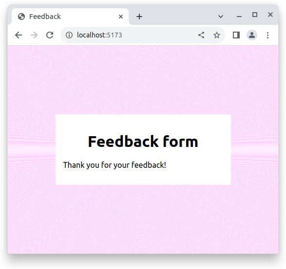

# Login form practice

View the example screenshot below and use React to implement as best you can. Try to match the style as well.

By clicking on Send button you must hide the form and display a thank you message, for example "Thank you for your feedback!".

## Examples

[Live demo](https://digitalcareerinstitute.github.io/SPA-Component-FeedbackForm/)

## Requirements

- Don't edit App.css.

- Create a state variable `data` (of type Object) in App
    - This is to keep track of the inputs

- Create a state variable `submitted` (of type Boolean) in App
    - This is to keep track of has the form been submitted

- Create an `onChange` function in `App` to handle all input state updates

- Create a `<form>` for the inputs
    - Use an `onSubmit` to handle submitting the data
    - No need to actually send the data anywhere

- Create an `Input.jsx` Component
    - Render all three inputs from App with `Input`
    - Note that the message is a `textarea`
    - Input needs name, type, value and onChange as props
    - Create `Input.css` to keep label, input and textarea styling
