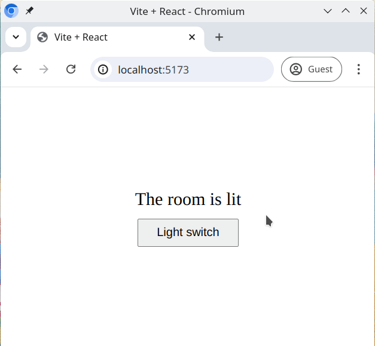

# Light switch

Just look at the "state" this room (component) is in ... 😉

A room is a good example to showcase how state works. In the room we have a light, with a switch. The switch can either be in the _"on"_ state, or the _"off"_ state.

## Task

Working in the [src/Room.jsx](./src/Room.jsx) file, create and export a `Room` component with all the features you need for the light to work. **Do not edit any other files**.

You will need;

- a `
` for the room
- a light switch (`<button>`)
- a `
` element to give a textual representation of a state, for example _"The light is on"_ or _"The light is off"_

Clicking the button should toggle the light between the on and off states, and the background color should change depending on the state

## Requirements

- Clicking the button should toggle the light on and off
- Use a `useState` hook to store the light switch state. The state itself should be represented as a **boolean**.
- If the switch is in the _"on"_ state:
  - The `className` of the `
` should be set to 'lit'
  - The `
` should have the text "The room is bright"
- If the switch is in the _"off"_ state:
  - The `className` of the `
` should be set to 'dark'
  - The `
` should have the text "The room is dark"
- By default the switch should be _"on"_

## Expected Result

