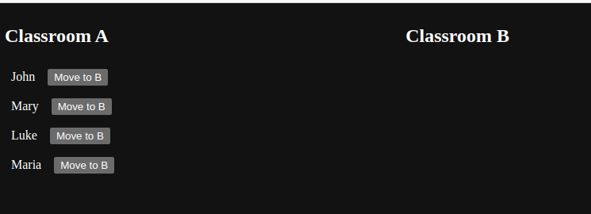
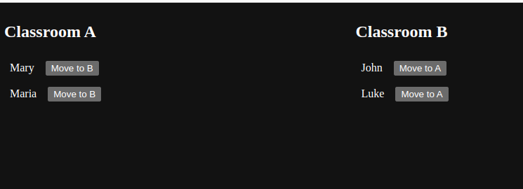

# Swapping classrooms

- The app is consisted of two columns - classroom A and classroom b
- The goal is to move students from one classroom to another by clicking the button next to their name
- There is no need to create additional elements in the JSX

1. Create a handler and attach it to the buttons to trigger the reducer
2. In the reducer, write the logic which will move students from classroom a to classroom b, and vice versa

