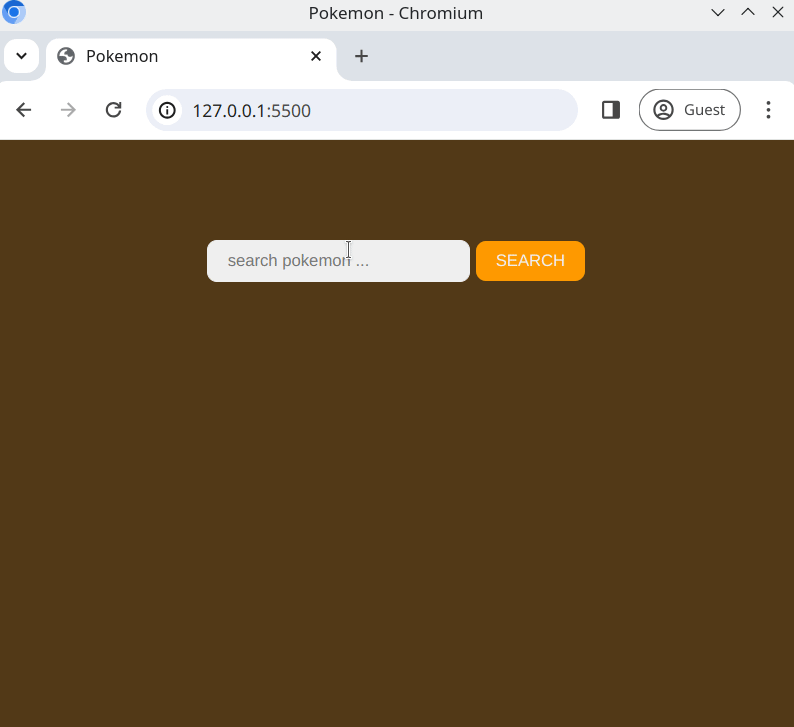

# Pokemon-Karten

Erstelle eine Suchmaschine für Pokemon mit der Fetch API und der Pokemon API.

## Aufgabe

Benutze die [Fetch API](https://developer.mozilla.org/en-US/docs/Web/API/Fetch_API) und die [Pokemon API](https://pokeapi.co/);

- Baue eine Website, die es dem Benutzer ermöglicht, nach Pokemon zu suchen. Der Benutzer sollte in der Lage sein, mit einem `<input />`-Feld und einem `<button>` mit der Seite zu interagieren.

## Anforderungen

- Es sollte ein `<input />`-Feld für die Suchkriterien vorhanden sein.
- Es sollte einen Button geben, der bei `click` den `value` des `<input />`-Feldes verwendet, um;

  - Überprüfen, dass der `value` nicht leer ist
  - Wenn `value` leer ist, eine Warnung an den Benutzer anzeigen
  - Die [Pokemon API](https://pokeapi.co/) durchsuchen
  - Das Ergebnis der API auf der Seite anzeigen
  - Das Ergebnis sollte die folgenden Eigenschaften enthalten;
    - name
    - front_default (Bild)
    - stats
    - abilities

- Die Ergebnisse sollten so gestylt sein, dass sie wie eine Karte aussehen (siehe **Erwartetes Ergebnis** unten)

## Erwartetes Ergebnis

