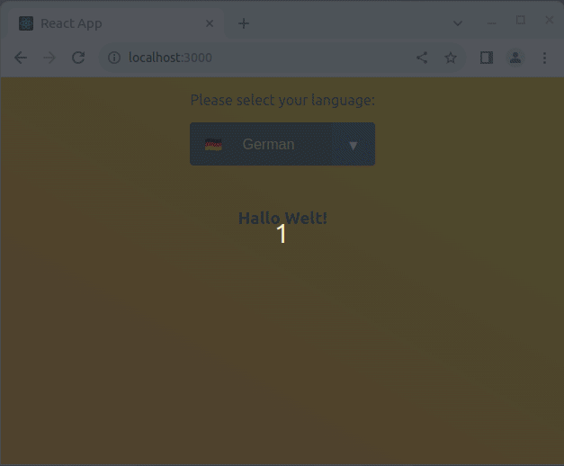

# Language chooser

This exercise is about practicing `useContext`.

You are tasked with creating a website language chooser demonstration.

## Example

## Tasks

- Display a dropdown selection, where the user can choose between different languages
- Show a message in the chosen language

    - GER: "Hallo Welt!"
    - ENG: "Hello World!"
    - Feel free to add other languages :)

- If the user changes the language settings, the message should be updated accordingly
- Style to your liking
- Structure your app as follows:

    - `App` has Header and Content as children
        - `Header`
        - `Content`

    - `Header` has LanguageChooser as a child
        - `LanguageChooser` which has a dropdown-list

    - `Content` has WelcomeMessage as a child
        - `WelcomeMessage` shows a message in the chosen language
