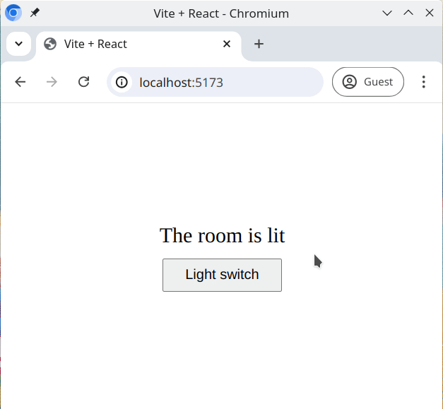

# Lichtschalter

Schau dir nur den "Zustand" dieses Raums (Komponente) an ... 😉

Ein Raum ist ein gutes Beispiel, um zu zeigen, wie Zustände funktionieren. In dem Raum haben wir ein Licht mit einem Schalter. Der Schalter kann entweder im _"an"_ Zustand oder im _"aus"_ Zustand sein.

## Aufgabe

Arbeite in der Datei [src/Room.jsx](./src/Room.jsx), erstelle und exportiere eine `Room` Komponente mit allen Funktionen, die du für das Funktionieren des Lichts benötigst. **Bearbeite keine anderen Dateien**.

Du benötigst:

- ein `
` für den Raum
- einen Lichtschalter (`<button>`)
- ein `
` Element, um eine textuelle Darstellung eines Zustands zu geben, zum Beispiel _"Das Licht ist an"_ oder _"Das Licht ist aus"_

Ein Klick auf den Button sollte das Licht zwischen den Zuständen an und aus umschalten, und die Hintergrundfarbe sollte sich je nach Zustand ändern

## Anforderungen

- Ein Klick auf den Button sollte das Licht ein- und ausschalten
- Verwende einen `useState` Hook, um den Zustand des Lichtschalters zu speichern. Der Zustand selbst sollte als **boolean** repräsentiert werden.
- Wenn der Schalter im _"an"_ Zustand ist:
  - Das `className` des `
` sollte auf 'lit' gesetzt werden
  - Das `
` sollte den Text "Das Zimmer ist hell" haben
- Wenn der Schalter im _"aus"_ Zustand ist:
  - Das `className` des `
` sollte auf 'dark' gesetzt werden
  - Das `
` sollte den Text "Das Zimmer ist dunkel" haben
- Standardmäßig sollte der Schalter auf _"an"_ sein

## Erwartetes Ergebnis

