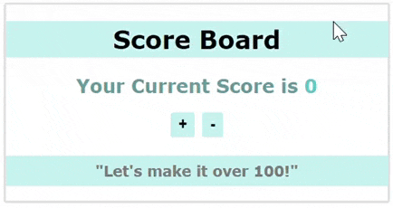

# Erstelle eine einfache Anzeigetafel mit Context API

In dieser Übung üben wir, wie man den globalen Zustand mit dem React Hook `useContext` verwaltet. Siehe das Referenzbild unten:

## Aufgaben

### Aufgabe 1 - Einrichtung

Erstelle eine neue React-App;

- führe `npx create-react-app scoreboard` im Terminal aus
- Starte den Server mit `npm start`
- Erstelle im `src`-Ordner einen neuen Ordner namens `Components`

### Aufgabe 2

- Erstelle die Komponente `Scoreboard` im Ordner `Components`
- Füge Inhalte wie im obigen Bild hinzu
- füge zwei Schaltflächen hinzu (+, -)
- importiere die `Scoreboard`-Komponente in `App.js`

### Aufgabe 3

Im `src`-Ordner;

- erstelle einen neuen Ordner namens `Contexts`
- füge `ScoreContext.js` zum `Contexts`-Ordner hinzu

> Beachte, dass wir den Context in einer separaten Datei initialisieren, da wir ihn in der gesamten App verwenden werden

### Aufgabe 4

In `ScoreContext.js`;

- Importiere `useState` und `createContext` aus React
- Erstelle und exportiere einen Context namens `ScoreContext`
- Erstelle einen Context-Provider namens `ScoreContextProvider`

### Aufgabe 5

- Innerhalb des `ScoreContextProvider`, deklariere eine State-Variable namens `score` mit einem Anfangswert von `0` und
- schreibe zwei Funktionen:
  - `plusScore(): score + 10`
  - `minusScore(): score - 10`
- Verwende die `value`-Eigenschaft, um diese drei Variablen (`score`, `plusScore`, `minusScore`) für alle untergeordneten Komponenten zugänglich zu machen

### Aufgabe 6

In `App.js`;

- Importiere die `ScoreContextProvider`-Komponente
- Um den Context für die untergeordneten Komponenten zugänglich zu machen, umschließe die `App`-Komponente mit der `ScoreContextProvider`-Komponente

### Aufgabe 7

In `Scoreboard.js`;

- Importiere `useContext` aus React.
- Importiere `ScoreContext` aus dem `Contexts`-Ordner
- greife auf den Wert zu, der vom Context weitergegeben wird. Verwende den Wert `score` aus dem Context für den `h2`-Text
- verbinde die Funktionen `plusScore`,`minusScore` mit den Klick-Events der Schaltflächen

### Aufgabe 8

- Erstelle im Ordner `Components` die Komponente `Infoboard`
- Füge ein `h3`-Element mit dem Text **"Let's make it over 100!"** hinzu
- Der Inhalt sollte sich in **"Good job!"** ändern, sobald der Punktestand über `100` liegt. Nutze `score` aus dem Context.
